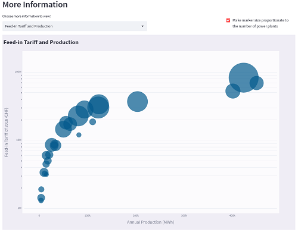

# Renewable Energy in Switzerland

 

#### -- Streamlit App Link: [Renewable Energy Streamlit App](https://khoryz-my-first-streamlitapp-srcpowerplant-rvueq9.streamlitapp.com/)
#### -- Project Status: [Completed]

## Project Intro/Objective
The purpose of this project is to provide some summary statistics on the renewable energy plants in Switzerland.

### Method Used
* Data Visualization

### Technologies
* Python
* Pandas
* Plotly
* Jupyter Lab
* PyCharm
* Streamlit

## Project Description
The project involves creating a Streamlit app on information about the renewable energy plants in Switzerland, such as the amount, distribution within the country, feed-in tariff, and main energy sources. The source of the data is the Open Power System Data website.
